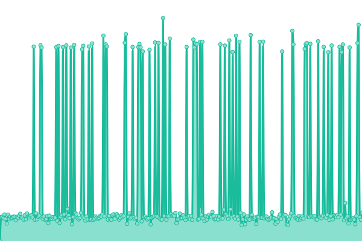

# [📈 Live Status](https://status.klutzybubbles.me): <!--live status--> **🟧 Partial outage**

This repository contains the open-source uptime monitor and status page for [klutzybubbles](https://status.klutzybubbles.me), powered by [Upptime](https://github.com/upptime/upptime).

With [Upptime](https://upptime.js.org), you can get your own unlimited and free uptime monitor and status page, powered entirely by a GitHub repository. We use [Issues](https://github.com/klutzybubbles/klutzybubbles-status/issues) as incident reports, [Actions](https://github.com/klutzybubbles/klutzybubbles-status/actions) as uptime monitors, and [Pages](https://status.klutzybubbles.me) for the status page.

<!--start: status pages-->
<!-- This summary is generated by Upptime (https://github.com/upptime/upptime) -->
<!-- Do not edit this manually, your changes will be overwritten -->
<!-- prettier-ignore -->
| URL | Status | History | Response Time | Uptime |
| --- | ------ | ------- | ------------- | ------ |
|  [Baseline](https://www.google.com) | 🟩 Up | [baseline.yml](https://github.com/KlutzyBubbles/klutzybubbles-status/commits/HEAD/history/baseline.yml) | 

 89ms
     
 | 

<a href="https://status.klutzybubbles.me/history/baseline">100.00%</a>
    

|  [AWX](http://awx.klutzybubbles.me) | 🟥 Down | [awx.yml](https://github.com/KlutzyBubbles/klutzybubbles-status/commits/HEAD/history/awx.yml) | 

 1366ms
     
 | 

<a href="https://status.klutzybubbles.me/history/awx">16.83%</a>
    

|  [GorillaToes Minecraft](https://mc.gorillatoes.net) | 🟥 Down | [gorilla-toes-minecraft.yml](https://github.com/KlutzyBubbles/klutzybubbles-status/commits/HEAD/history/gorilla-toes-minecraft.yml) | 

 0ms
     
 | 

<a href="https://status.klutzybubbles.me/history/gorilla-toes-minecraft">0.00%</a>
    

|  [Paperless](https://paperless.klutzybubbles.me) | 🟥 Down | [paperless.yml](https://github.com/KlutzyBubbles/klutzybubbles-status/commits/HEAD/history/paperless.yml) | 

 0ms
     
 | 

<a href="https://status.klutzybubbles.me/history/paperless">0.00%</a>
    

|  [Gitea](http://git.klutzybubbles.me) | 🟥 Down | [gitea.yml](https://github.com/KlutzyBubbles/klutzybubbles-status/commits/HEAD/history/gitea.yml) | 

 466ms
     
 | 

<a href="https://status.klutzybubbles.me/history/gitea">17.25%</a>
    

<!--end: status pages-->

[**Visit our status website →**](https://status.klutzybubbles.me)

## 📄 License

- Powered by: [Upptime](https://github.com/upptime/upptime)
- Code: [MIT](./LICENSE) © [klutzybubbles](https://status.klutzybubbles.me)
- Data in the `./history` directory: [Open Database License](https://opendatacommons.org/licenses/odbl/1-0/)
