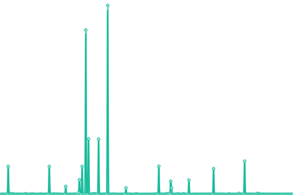
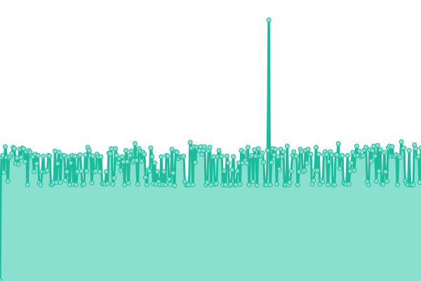
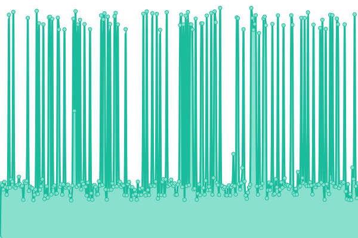
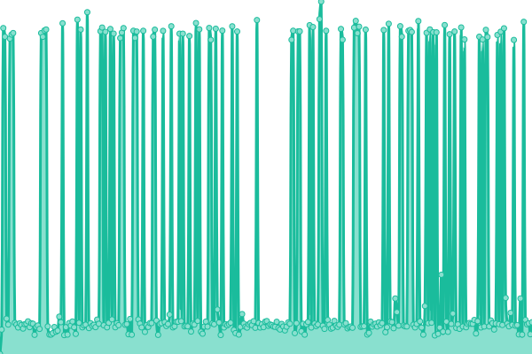
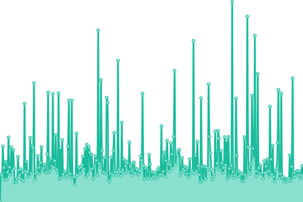

# [📈 Live Status](https://status.klutzybubbles.me): <!--live status--> **🟧 Partial outage**

This repository contains the open-source uptime monitor and status page for [klutzybubbles](https://status.klutzybubbles.me), powered by [Upptime](https://github.com/upptime/upptime).

With [Upptime](https://upptime.js.org), you can get your own unlimited and free uptime monitor and status page, powered entirely by a GitHub repository. We use [Issues](https://github.com/klutzybubbles/klutzybubbles-status/issues) as incident reports, [Actions](https://github.com/klutzybubbles/klutzybubbles-status/actions) as uptime monitors, and [Pages](https://status.klutzybubbles.me) for the status page.

<!--start: status pages-->
<!-- This summary is generated by Upptime (https://github.com/upptime/upptime) -->
<!-- Do not edit this manually, your changes will be overwritten -->
<!-- prettier-ignore -->
| URL | Status | History | Response Time | Uptime |
| --- | ------ | ------- | ------------- | ------ |
|  [Baseline](https://www.google.com) | 🟩 Up | [baseline.yml](https://github.com/KlutzyBubbles/klutzybubbles-status/commits/HEAD/history/baseline.yml) | 

 127ms
     
 | 

<a href="https://status.klutzybubbles.me/history/baseline">100.00%</a>
    

|  Game Server 1 | 🟥 Down | [game-server-1.yml](https://github.com/KlutzyBubbles/klutzybubbles-status/commits/HEAD/history/game-server-1.yml) | 

 0ms
     
 | 

<a href="https://status.klutzybubbles.me/history/game-server-1">0.00%</a>
    

|  Game Server 2 | 🟥 Down | [game-server-2.yml](https://github.com/KlutzyBubbles/klutzybubbles-status/commits/HEAD/history/game-server-2.yml) | 

 0ms
     
 | 

<a href="https://status.klutzybubbles.me/history/game-server-2">0.00%</a>
    

|  [Gitea](http://git.klutzybubbles.me) | 🟩 Up | [gitea.yml](https://github.com/KlutzyBubbles/klutzybubbles-status/commits/HEAD/history/gitea.yml) | 

 1444ms
     
 | 

<a href="https://status.klutzybubbles.me/history/gitea">99.82%</a>
    

|  [Overseerr](http://overseerr.klutzybubbles.me) | 🟩 Up | [overseerr.yml](https://github.com/KlutzyBubbles/klutzybubbles-status/commits/HEAD/history/overseerr.yml) | 

 3996ms
     
 | 

<a href="https://status.klutzybubbles.me/history/overseerr">99.82%</a>
    

|  [Klutzy Plex](http://plex.klutzybubbles.me:32400/identity) | 🟩 Up | [klutzy-plex.yml](https://github.com/KlutzyBubbles/klutzybubbles-status/commits/HEAD/history/klutzy-plex.yml) | 

 1655ms
     
 | 

<a href="https://status.klutzybubbles.me/history/klutzy-plex">99.83%</a>
    

|  [Plex App](https://app.plex.tv/) | 🟩 Up | [plex-app.yml](https://github.com/KlutzyBubbles/klutzybubbles-status/commits/HEAD/history/plex-app.yml) | 

 155ms
     
 | 

<a href="https://status.klutzybubbles.me/history/plex-app">100.00%</a>
    

<!--end: status pages-->

[**Visit our status website →**](https://status.klutzybubbles.me)

## 📄 License

- Powered by: [Upptime](https://github.com/upptime/upptime)
- Code: [MIT](./LICENSE) © [klutzybubbles](https://status.klutzybubbles.me)
- Data in the `./history` directory: [Open Database License](https://opendatacommons.org/licenses/odbl/1-0/)
